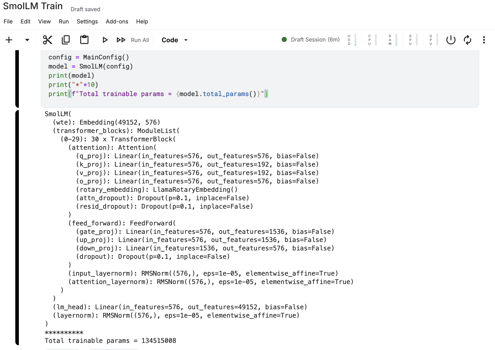

# SmolLM2 Implementation
This is a PyTorch implementation of the SmolLM2-135M model. This contains the decoder implementation of the model. The model is trained on cosmopedia-10k dataset from the Huggingface datasets library.

# Model Overview
The model contains:
- 30 Transformer Blocks
- 576 embedding dimensions
- 9 attention heads for Q & 3 attention heads for K & V
- max_seq_len = 1024
- vocab_size = 49152
- 134.5M parameters
<br>


# Training Highlights
- The model was trained on Kaggle T4 GPU for ~300 epochs
- Weights have been shared between the embedding and the output layer
- Made use of mixed precision training
- Training logs can be found in the `logs` directory

## Model Architecture
```
=======================================================================================================================================
Layer (type (var_name))                                      Input Shape               Output Shape              Param #
=======================================================================================================================================
SmolLM (SmolLM)                                              [4, 1024]                 [4, 1024, 49152]          --
├─Embedding (wte)                                            [4, 1024]                 [4, 1024, 576]            28,311,552
├─ModuleList (transformer_blocks)                            --                        --                        --
│    └─TransformerBlock (0)                                  [4, 1024, 576]            [4, 1024, 576]            --
│    │    └─RMSNorm (input_layernorm)                        [4, 1024, 576]            [4, 1024, 576]            576
│    │    └─Attention (attention)                            [4, 1024, 576]            [4, 1024, 576]            --
│    │    │    └─Linear (q_proj)                             [4, 1024, 576]            [4, 1024, 576]            331,776
│    │    │    └─Linear (k_proj)                             [4, 1024, 576]            [4, 1024, 192]            110,592
│    │    │    └─Linear (v_proj)                             [4, 1024, 576]            [4, 1024, 192]            110,592
│    │    │    └─LlamaRotaryEmbedding (rotary_embedding)     [4, 9, 1024, 64]          [4, 9, 1024, 64]          --
│    │    │    └─Dropout (attn_dropout)                      [4, 9, 1024, 1024]        [4, 9, 1024, 1024]        --
│    │    │    └─Linear (o_proj)                             [4, 1024, 576]            [4, 1024, 576]            331,776
│    │    │    └─Dropout (resid_dropout)                     [4, 1024, 576]            [4, 1024, 576]            --
│    │    └─RMSNorm (attention_layernorm)                    [4, 1024, 576]            [4, 1024, 576]            576
│    │    └─FeedForward (feed_forward)                       [4, 1024, 576]            [4, 1024, 576]            --
│    │    │    └─Linear (gate_proj)                          [4, 1024, 576]            [4, 1024, 1536]           884,736
│    │    │    └─Linear (up_proj)                            [4, 1024, 576]            [4, 1024, 1536]           884,736
│    │    │    └─Linear (down_proj)                          [4, 1024, 1536]           [4, 1024, 576]            884,736
│    │    │    └─Dropout (dropout)                           [4, 1024, 576]            [4, 1024, 576]            --
│    └─TransformerBlock (1)                                  [4, 1024, 576]            [4, 1024, 576]            --
│    │    └─RMSNorm (input_layernorm)                        [4, 1024, 576]            [4, 1024, 576]            576
│    │    └─Attention (attention)                            [4, 1024, 576]            [4, 1024, 576]            --
│    │    │    └─Linear (q_proj)                             [4, 1024, 576]            [4, 1024, 576]            331,776
│    │    │    └─Linear (k_proj)                             [4, 1024, 576]            [4, 1024, 192]            110,592
│    │    │    └─Linear (v_proj)                             [4, 1024, 576]            [4, 1024, 192]            110,592
│    │    │    └─LlamaRotaryEmbedding (rotary_embedding)     [4, 9, 1024, 64]          [4, 9, 1024, 64]          --
│    │    │    └─Dropout (attn_dropout)                      [4, 9, 1024, 1024]        [4, 9, 1024, 1024]        --
│    │    │    └─Linear (o_proj)                             [4, 1024, 576]            [4, 1024, 576]            331,776
│    │    │    └─Dropout (resid_dropout)                     [4, 1024, 576]            [4, 1024, 576]            --
│    │    └─RMSNorm (attention_layernorm)                    [4, 1024, 576]            [4, 1024, 576]            576
│    │    └─FeedForward (feed_forward)                       [4, 1024, 576]            [4, 1024, 576]            --
│    │    │    └─Linear (gate_proj)                          [4, 1024, 576]            [4, 1024, 1536]           884,736
│    │    │    └─Linear (up_proj)                            [4, 1024, 576]            [4, 1024, 1536]           884,736
│    │    │    └─Linear (down_proj)                          [4, 1024, 1536]           [4, 1024, 576]            884,736
│    │    │    └─Dropout (dropout)                           [4, 1024, 576]            [4, 1024, 576]            --
│    └─TransformerBlock (2)                                  [4, 1024, 576]            [4, 1024, 576]            --
│    │    └─RMSNorm (input_layernorm)                        [4, 1024, 576]            [4, 1024, 576]            576
│    │    └─Attention (attention)                            [4, 1024, 576]            [4, 1024, 576]            --
│    │    │    └─Linear (q_proj)                             [4, 1024, 576]            [4, 1024, 576]            331,776
│    │    │    └─Linear (k_proj)                             [4, 1024, 576]            [4, 1024, 192]            110,592
│    │    │    └─Linear (v_proj)                             [4, 1024, 576]            [4, 1024, 192]            110,592
│    │    │    └─LlamaRotaryEmbedding (rotary_embedding)     [4, 9, 1024, 64]          [4, 9, 1024, 64]          --
│    │    │    └─Dropout (attn_dropout)                      [4, 9, 1024, 1024]        [4, 9, 1024, 1024]        --
│    │    │    └─Linear (o_proj)                             [4, 1024, 576]            [4, 1024, 576]            331,776
│    │    │    └─Dropout (resid_dropout)                     [4, 1024, 576]            [4, 1024, 576]            --
│    │    └─RMSNorm (attention_layernorm)                    [4, 1024, 576]            [4, 1024, 576]            576
│    │    └─FeedForward (feed_forward)                       [4, 1024, 576]            [4, 1024, 576]            --
│    │    │    └─Linear (gate_proj)                          [4, 1024, 576]            [4, 1024, 1536]           884,736
│    │    │    └─Linear (up_proj)                            [4, 1024, 576]            [4, 1024, 1536]           884,736
│    │    │    └─Linear (down_proj)                          [4, 1024, 1536]           [4, 1024, 576]            884,736
│    │    │    └─Dropout (dropout)                           [4, 1024, 576]            [4, 1024, 576]            --
│    └─TransformerBlock (3)                                  [4, 1024, 576]            [4, 1024, 576]            --
│    │    └─RMSNorm (input_layernorm)                        [4, 1024, 576]            [4, 1024, 576]            576
│    │    └─Attention (attention)                            [4, 1024, 576]            [4, 1024, 576]            --
│    │    │    └─Linear (q_proj)                             [4, 1024, 576]            [4, 1024, 576]            331,776
│    │    │    └─Linear (k_proj)                             [4, 1024, 576]            [4, 1024, 192]            110,592
│    │    │    └─Linear (v_proj)                             [4, 1024, 576]            [4, 1024, 192]            110,592
│    │    │    └─LlamaRotaryEmbedding (rotary_embedding)     [4, 9, 1024, 64]          [4, 9, 1024, 64]          --
│    │    │    └─Dropout (attn_dropout)                      [4, 9, 1024, 1024]        [4, 9, 1024, 1024]        --
│    │    │    └─Linear (o_proj)                             [4, 1024, 576]            [4, 1024, 576]            331,776
│    │    │    └─Dropout (resid_dropout)                     [4, 1024, 576]            [4, 1024, 576]            --
│    │    └─RMSNorm (attention_layernorm)                    [4, 1024, 576]            [4, 1024, 576]            576
│    │    └─FeedForward (feed_forward)                       [4, 1024, 576]            [4, 1024, 576]            --
│    │    │    └─Linear (gate_proj)                          [4, 1024, 576]            [4, 1024, 1536]           884,736
│    │    │    └─Linear (up_proj)                            [4, 1024, 576]            [4, 1024, 1536]           884,736
│    │    │    └─Linear (down_proj)                          [4, 1024, 1536]           [4, 1024, 576]            884,736
│    │    │    └─Dropout (dropout)                           [4, 1024, 576]            [4, 1024, 576]            --
│    └─TransformerBlock (4)                                  [4, 1024, 576]            [4, 1024, 576]            --
│    │    └─RMSNorm (input_layernorm)                        [4, 1024, 576]            [4, 1024, 576]            576
│    │    └─Attention (attention)                            [4, 1024, 576]            [4, 1024, 576]            --
│    │    │    └─Linear (q_proj)                             [4, 1024, 576]            [4, 1024, 576]            331,776
│    │    │    └─Linear (k_proj)                             [4, 1024, 576]            [4, 1024, 192]            110,592
│    │    │    └─Linear (v_proj)                             [4, 1024, 576]            [4, 1024, 192]            110,592
│    │    │    └─LlamaRotaryEmbedding (rotary_embedding)     [4, 9, 1024, 64]          [4, 9, 1024, 64]          --
│    │    │    └─Dropout (attn_dropout)                      [4, 9, 1024, 1024]        [4, 9, 1024, 1024]        --
│    │    │    └─Linear (o_proj)                             [4, 1024, 576]            [4, 1024, 576]            331,776
│    │    │    └─Dropout (resid_dropout)                     [4, 1024, 576]            [4, 1024, 576]            --
│    │    └─RMSNorm (attention_layernorm)                    [4, 1024, 576]            [4, 1024, 576]            576
│    │    └─FeedForward (feed_forward)                       [4, 1024, 576]            [4, 1024, 576]            --
│    │    │    └─Linear (gate_proj)                          [4, 1024, 576]            [4, 1024, 1536]           884,736
│    │    │    └─Linear (up_proj)                            [4, 1024, 576]            [4, 1024, 1536]           884,736
│    │    │    └─Linear (down_proj)                          [4, 1024, 1536]           [4, 1024, 576]            884,736
│    │    │    └─Dropout (dropout)                           [4, 1024, 576]            [4, 1024, 576]            --
│    └─TransformerBlock (5)                                  [4, 1024, 576]            [4, 1024, 576]            --
│    │    └─RMSNorm (input_layernorm)                        [4, 1024, 576]            [4, 1024, 576]            576
│    │    └─Attention (attention)                            [4, 1024, 576]            [4, 1024, 576]            --
│    │    │    └─Linear (q_proj)                             [4, 1024, 576]            [4, 1024, 576]            331,776
│    │    │    └─Linear (k_proj)                             [4, 1024, 576]            [4, 1024, 192]            110,592
│    │    │    └─Linear (v_proj)                             [4, 1024, 576]            [4, 1024, 192]            110,592
│    │    │    └─LlamaRotaryEmbedding (rotary_embedding)     [4, 9, 1024, 64]          [4, 9, 1024, 64]          --
│    │    │    └─Dropout (attn_dropout)                      [4, 9, 1024, 1024]        [4, 9, 1024, 1024]        --
│    │    │    └─Linear (o_proj)                             [4, 1024, 576]            [4, 1024, 576]            331,776
│    │    │    └─Dropout (resid_dropout)                     [4, 1024, 576]            [4, 1024, 576]            --
│    │    └─RMSNorm (attention_layernorm)                    [4, 1024, 576]            [4, 1024, 576]            576
│    │    └─FeedForward (feed_forward)                       [4, 1024, 576]            [4, 1024, 576]            --
│    │    │    └─Linear (gate_proj)                          [4, 1024, 576]            [4, 1024, 1536]           884,736
│    │    │    └─Linear (up_proj)                            [4, 1024, 576]            [4, 1024, 1536]           884,736
│    │    │    └─Linear (down_proj)                          [4, 1024, 1536]           [4, 1024, 576]            884,736
│    │    │    └─Dropout (dropout)                           [4, 1024, 576]            [4, 1024, 576]            --
│    └─TransformerBlock (6)                                  [4, 1024, 576]            [4, 1024, 576]            --
│    │    └─RMSNorm (input_layernorm)                        [4, 1024, 576]            [4, 1024, 576]            576
│    │    └─Attention (attention)                            [4, 1024, 576]            [4, 1024, 576]            --
│    │    │    └─Linear (q_proj)                             [4, 1024, 576]            [4, 1024, 576]            331,776
│    │    │    └─Linear (k_proj)                             [4, 1024, 576]            [4, 1024, 192]            110,592
│    │    │    └─Linear (v_proj)                             [4, 1024, 576]            [4, 1024, 192]            110,592
│    │    │    └─LlamaRotaryEmbedding (rotary_embedding)     [4, 9, 1024, 64]          [4, 9, 1024, 64]          --
│    │    │    └─Dropout (attn_dropout)                      [4, 9, 1024, 1024]        [4, 9, 1024, 1024]        --
│    │    │    └─Linear (o_proj)                             [4, 1024, 576]            [4, 1024, 576]            331,776
│    │    │    └─Dropout (resid_dropout)                     [4, 1024, 576]            [4, 1024, 576]            --
│    │    └─RMSNorm (attention_layernorm)                    [4, 1024, 576]            [4, 1024, 576]            576
│    │    └─FeedForward (feed_forward)                       [4, 1024, 576]            [4, 1024, 576]            --
│    │    │    └─Linear (gate_proj)                          [4, 1024, 576]            [4, 1024, 1536]           884,736
│    │    │    └─Linear (up_proj)                            [4, 1024, 576]            [4, 1024, 1536]           884,736
│    │    │    └─Linear (down_proj)                          [4, 1024, 1536]           [4, 1024, 576]            884,736
│    │    │    └─Dropout (dropout)                           [4, 1024, 576]            [4, 1024, 576]            --
│    └─TransformerBlock (7)                                  [4, 1024, 576]            [4, 1024, 576]            --
│    │    └─RMSNorm (input_layernorm)                        [4, 1024, 576]            [4, 1024, 576]            576
│    │    └─Attention (attention)                            [4, 1024, 576]            [4, 1024, 576]            --
│    │    │    └─Linear (q_proj)                             [4, 1024, 576]            [4, 1024, 576]            331,776
│    │    │    └─Linear (k_proj)                             [4, 1024, 576]            [4, 1024, 192]            110,592
│    │    │    └─Linear (v_proj)                             [4, 1024, 576]            [4, 1024, 192]            110,592
│    │    │    └─LlamaRotaryEmbedding (rotary_embedding)     [4, 9, 1024, 64]          [4, 9, 1024, 64]          --
│    │    │    └─Dropout (attn_dropout)                      [4, 9, 1024, 1024]        [4, 9, 1024, 1024]        --
│    │    │    └─Linear (o_proj)                             [4, 1024, 576]            [4, 1024, 576]            331,776
│    │    │    └─Dropout (resid_dropout)                     [4, 1024, 576]            [4, 1024, 576]            --
│    │    └─RMSNorm (attention_layernorm)                    [4, 1024, 576]            [4, 1024, 576]            576
│    │    └─FeedForward (feed_forward)                       [4, 1024, 576]            [4, 1024, 576]            --
│    │    │    └─Linear (gate_proj)                          [4, 1024, 576]            [4, 1024, 1536]           884,736
│    │    │    └─Linear (up_proj)                            [4, 1024, 576]            [4, 1024, 1536]           884,736
│    │    │    └─Linear (down_proj)                          [4, 1024, 1536]           [4, 1024, 576]            884,736
│    │    │    └─Dropout (dropout)                           [4, 1024, 576]            [4, 1024, 576]            --
│    └─TransformerBlock (8)                                  [4, 1024, 576]            [4, 1024, 576]            --
│    │    └─RMSNorm (input_layernorm)                        [4, 1024, 576]            [4, 1024, 576]            576
│    │    └─Attention (attention)                            [4, 1024, 576]            [4, 1024, 576]            --
│    │    │    └─Linear (q_proj)                             [4, 1024, 576]            [4, 1024, 576]            331,776
│    │    │    └─Linear (k_proj)                             [4, 1024, 576]            [4, 1024, 192]            110,592
│    │    │    └─Linear (v_proj)                             [4, 1024, 576]            [4, 1024, 192]            110,592
│    │    │    └─LlamaRotaryEmbedding (rotary_embedding)     [4, 9, 1024, 64]          [4, 9, 1024, 64]          --
│    │    │    └─Dropout (attn_dropout)                      [4, 9, 1024, 1024]        [4, 9, 1024, 1024]        --
│    │    │    └─Linear (o_proj)                             [4, 1024, 576]            [4, 1024, 576]            331,776
│    │    │    └─Dropout (resid_dropout)                     [4, 1024, 576]            [4, 1024, 576]            --
│    │    └─RMSNorm (attention_layernorm)                    [4, 1024, 576]            [4, 1024, 576]            576
│    │    └─FeedForward (feed_forward)                       [4, 1024, 576]            [4, 1024, 576]            --
│    │    │    └─Linear (gate_proj)                          [4, 1024, 576]            [4, 1024, 1536]           884,736
│    │    │    └─Linear (up_proj)                            [4, 1024, 576]            [4, 1024, 1536]           884,736
│    │    │    └─Linear (down_proj)                          [4, 1024, 1536]           [4, 1024, 576]            884,736
│    │    │    └─Dropout (dropout)                           [4, 1024, 576]            [4, 1024, 576]            --
│    └─TransformerBlock (9)                                  [4, 1024, 576]            [4, 1024, 576]            --
│    │    └─RMSNorm (input_layernorm)                        [4, 1024, 576]            [4, 1024, 576]            576
│    │    └─Attention (attention)                            [4, 1024, 576]            [4, 1024, 576]            --
│    │    │    └─Linear (q_proj)                             [4, 1024, 576]            [4, 1024, 576]            331,776
│    │    │    └─Linear (k_proj)                             [4, 1024, 576]            [4, 1024, 192]            110,592
│    │    │    └─Linear (v_proj)                             [4, 1024, 576]            [4, 1024, 192]            110,592
│    │    │    └─LlamaRotaryEmbedding (rotary_embedding)     [4, 9, 1024, 64]          [4, 9, 1024, 64]          --
│    │    │    └─Dropout (attn_dropout)                      [4, 9, 1024, 1024]        [4, 9, 1024, 1024]        --
│    │    │    └─Linear (o_proj)                             [4, 1024, 576]            [4, 1024, 576]            331,776
│    │    │    └─Dropout (resid_dropout)                     [4, 1024, 576]            [4, 1024, 576]            --
│    │    └─RMSNorm (attention_layernorm)                    [4, 1024, 576]            [4, 1024, 576]            576
│    │    └─FeedForward (feed_forward)                       [4, 1024, 576]            [4, 1024, 576]            --
│    │    │    └─Linear (gate_proj)                          [4, 1024, 576]            [4, 1024, 1536]           884,736
│    │    │    └─Linear (up_proj)                            [4, 1024, 576]            [4, 1024, 1536]           884,736
│    │    │    └─Linear (down_proj)                          [4, 1024, 1536]           [4, 1024, 576]            884,736
│    │    │    └─Dropout (dropout)                           [4, 1024, 576]            [4, 1024, 576]            --
│    └─TransformerBlock (10)                                 [4, 1024, 576]            [4, 1024, 576]            --
│    │    └─RMSNorm (input_layernorm)                        [4, 1024, 576]            [4, 1024, 576]            576
│    │    └─Attention (attention)                            [4, 1024, 576]            [4, 1024, 576]            --
│    │    │    └─Linear (q_proj)                             [4, 1024, 576]            [4, 1024, 576]            331,776
│    │    │    └─Linear (k_proj)                             [4, 1024, 576]            [4, 1024, 192]            110,592
│    │    │    └─Linear (v_proj)                             [4, 1024, 576]            [4, 1024, 192]            110,592
│    │    │    └─LlamaRotaryEmbedding (rotary_embedding)     [4, 9, 1024, 64]          [4, 9, 1024, 64]          --
│    │    │    └─Dropout (attn_dropout)                      [4, 9, 1024, 1024]        [4, 9, 1024, 1024]        --
│    │    │    └─Linear (o_proj)                             [4, 1024, 576]            [4, 1024, 576]            331,776
│    │    │    └─Dropout (resid_dropout)                     [4, 1024, 576]            [4, 1024, 576]            --
│    │    └─RMSNorm (attention_layernorm)                    [4, 1024, 576]            [4, 1024, 576]            576
│    │    └─FeedForward (feed_forward)                       [4, 1024, 576]            [4, 1024, 576]            --
│    │    │    └─Linear (gate_proj)                          [4, 1024, 576]            [4, 1024, 1536]           884,736
│    │    │    └─Linear (up_proj)                            [4, 1024, 576]            [4, 1024, 1536]           884,736
│    │    │    └─Linear (down_proj)                          [4, 1024, 1536]           [4, 1024, 576]            884,736
│    │    │    └─Dropout (dropout)                           [4, 1024, 576]            [4, 1024, 576]            --
│    └─TransformerBlock (11)                                 [4, 1024, 576]            [4, 1024, 576]            --
│    │    └─RMSNorm (input_layernorm)                        [4, 1024, 576]            [4, 1024, 576]            576
│    │    └─Attention (attention)                            [4, 1024, 576]            [4, 1024, 576]            --
│    │    │    └─Linear (q_proj)                             [4, 1024, 576]            [4, 1024, 576]            331,776
│    │    │    └─Linear (k_proj)                             [4, 1024, 576]            [4, 1024, 192]            110,592
│    │    │    └─Linear (v_proj)                             [4, 1024, 576]            [4, 1024, 192]            110,592
│    │    │    └─LlamaRotaryEmbedding (rotary_embedding)     [4, 9, 1024, 64]          [4, 9, 1024, 64]          --
│    │    │    └─Dropout (attn_dropout)                      [4, 9, 1024, 1024]        [4, 9, 1024, 1024]        --
│    │    │    └─Linear (o_proj)                             [4, 1024, 576]            [4, 1024, 576]            331,776
│    │    │    └─Dropout (resid_dropout)                     [4, 1024, 576]            [4, 1024, 576]            --
│    │    └─RMSNorm (attention_layernorm)                    [4, 1024, 576]            [4, 1024, 576]            576
│    │    └─FeedForward (feed_forward)                       [4, 1024, 576]            [4, 1024, 576]            --
│    │    │    └─Linear (gate_proj)                          [4, 1024, 576]            [4, 1024, 1536]           884,736
│    │    │    └─Linear (up_proj)                            [4, 1024, 576]            [4, 1024, 1536]           884,736
│    │    │    └─Linear (down_proj)                          [4, 1024, 1536]           [4, 1024, 576]            884,736
│    │    │    └─Dropout (dropout)                           [4, 1024, 576]            [4, 1024, 576]            --
│    └─TransformerBlock (12)                                 [4, 1024, 576]            [4, 1024, 576]            --
│    │    └─RMSNorm (input_layernorm)                        [4, 1024, 576]            [4, 1024, 576]            576
│    │    └─Attention (attention)                            [4, 1024, 576]            [4, 1024, 576]            --
│    │    │    └─Linear (q_proj)                             [4, 1024, 576]            [4, 1024, 576]            331,776
│    │    │    └─Linear (k_proj)                             [4, 1024, 576]            [4, 1024, 192]            110,592
│    │    │    └─Linear (v_proj)                             [4, 1024, 576]            [4, 1024, 192]            110,592
│    │    │    └─LlamaRotaryEmbedding (rotary_embedding)     [4, 9, 1024, 64]          [4, 9, 1024, 64]          --
│    │    │    └─Dropout (attn_dropout)                      [4, 9, 1024, 1024]        [4, 9, 1024, 1024]        --
│    │    │    └─Linear (o_proj)                             [4, 1024, 576]            [4, 1024, 576]            331,776
│    │    │    └─Dropout (resid_dropout)                     [4, 1024, 576]            [4, 1024, 576]            --
│    │    └─RMSNorm (attention_layernorm)                    [4, 1024, 576]            [4, 1024, 576]            576
│    │    └─FeedForward (feed_forward)                       [4, 1024, 576]            [4, 1024, 576]            --
│    │    │    └─Linear (gate_proj)                          [4, 1024, 576]            [4, 1024, 1536]           884,736
│    │    │    └─Linear (up_proj)                            [4, 1024, 576]            [4, 1024, 1536]           884,736
│    │    │    └─Linear (down_proj)                          [4, 1024, 1536]           [4, 1024, 576]            884,736
│    │    │    └─Dropout (dropout)                           [4, 1024, 576]            [4, 1024, 576]            --
│    └─TransformerBlock (13)                                 [4, 1024, 576]            [4, 1024, 576]            --
│    │    └─RMSNorm (input_layernorm)                        [4, 1024, 576]            [4, 1024, 576]            576
│    │    └─Attention (attention)                            [4, 1024, 576]            [4, 1024, 576]            --
│    │    │    └─Linear (q_proj)                             [4, 1024, 576]            [4, 1024, 576]            331,776
│    │    │    └─Linear (k_proj)                             [4, 1024, 576]            [4, 1024, 192]            110,592
│    │    │    └─Linear (v_proj)                             [4, 1024, 576]            [4, 1024, 192]            110,592
│    │    │    └─LlamaRotaryEmbedding (rotary_embedding)     [4, 9, 1024, 64]          [4, 9, 1024, 64]          --
│    │    │    └─Dropout (attn_dropout)                      [4, 9, 1024, 1024]        [4, 9, 1024, 1024]        --
│    │    │    └─Linear (o_proj)                             [4, 1024, 576]            [4, 1024, 576]            331,776
│    │    │    └─Dropout (resid_dropout)                     [4, 1024, 576]            [4, 1024, 576]            --
│    │    └─RMSNorm (attention_layernorm)                    [4, 1024, 576]            [4, 1024, 576]            576
│    │    └─FeedForward (feed_forward)                       [4, 1024, 576]            [4, 1024, 576]            --
│    │    │    └─Linear (gate_proj)                          [4, 1024, 576]            [4, 1024, 1536]           884,736
│    │    │    └─Linear (up_proj)                            [4, 1024, 576]            [4, 1024, 1536]           884,736
│    │    │    └─Linear (down_proj)                          [4, 1024, 1536]           [4, 1024, 576]            884,736
│    │    │    └─Dropout (dropout)                           [4, 1024, 576]            [4, 1024, 576]            --
│    └─TransformerBlock (14)                                 [4, 1024, 576]            [4, 1024, 576]            --
│    │    └─RMSNorm (input_layernorm)                        [4, 1024, 576]            [4, 1024, 576]            576
│    │    └─Attention (attention)                            [4, 1024, 576]            [4, 1024, 576]            --
│    │    │    └─Linear (q_proj)                             [4, 1024, 576]            [4, 1024, 576]            331,776
│    │    │    └─Linear (k_proj)                             [4, 1024, 576]            [4, 1024, 192]            110,592
│    │    │    └─Linear (v_proj)                             [4, 1024, 576]            [4, 1024, 192]            110,592
│    │    │    └─LlamaRotaryEmbedding (rotary_embedding)     [4, 9, 1024, 64]          [4, 9, 1024, 64]          --
│    │    │    └─Dropout (attn_dropout)                      [4, 9, 1024, 1024]        [4, 9, 1024, 1024]        --
│    │    │    └─Linear (o_proj)                             [4, 1024, 576]            [4, 1024, 576]            331,776
│    │    │    └─Dropout (resid_dropout)                     [4, 1024, 576]            [4, 1024, 576]            --
│    │    └─RMSNorm (attention_layernorm)                    [4, 1024, 576]            [4, 1024, 576]            576
│    │    └─FeedForward (feed_forward)                       [4, 1024, 576]            [4, 1024, 576]            --
│    │    │    └─Linear (gate_proj)                          [4, 1024, 576]            [4, 1024, 1536]           884,736
│    │    │    └─Linear (up_proj)                            [4, 1024, 576]            [4, 1024, 1536]           884,736
│    │    │    └─Linear (down_proj)                          [4, 1024, 1536]           [4, 1024, 576]            884,736
│    │    │    └─Dropout (dropout)                           [4, 1024, 576]            [4, 1024, 576]            --
│    └─TransformerBlock (15)                                 [4, 1024, 576]            [4, 1024, 576]            --
│    │    └─RMSNorm (input_layernorm)                        [4, 1024, 576]            [4, 1024, 576]            576
│    │    └─Attention (attention)                            [4, 1024, 576]            [4, 1024, 576]            --
│    │    │    └─Linear (q_proj)                             [4, 1024, 576]            [4, 1024, 576]            331,776
│    │    │    └─Linear (k_proj)                             [4, 1024, 576]            [4, 1024, 192]            110,592
│    │    │    └─Linear (v_proj)                             [4, 1024, 576]            [4, 1024, 192]            110,592
│    │    │    └─LlamaRotaryEmbedding (rotary_embedding)     [4, 9, 1024, 64]          [4, 9, 1024, 64]          --
│    │    │    └─Dropout (attn_dropout)                      [4, 9, 1024, 1024]        [4, 9, 1024, 1024]        --
│    │    │    └─Linear (o_proj)                             [4, 1024, 576]            [4, 1024, 576]            331,776
│    │    │    └─Dropout (resid_dropout)                     [4, 1024, 576]            [4, 1024, 576]            --
│    │    └─RMSNorm (attention_layernorm)                    [4, 1024, 576]            [4, 1024, 576]            576
│    │    └─FeedForward (feed_forward)                       [4, 1024, 576]            [4, 1024, 576]            --
│    │    │    └─Linear (gate_proj)                          [4, 1024, 576]            [4, 1024, 1536]           884,736
│    │    │    └─Linear (up_proj)                            [4, 1024, 576]            [4, 1024, 1536]           884,736
│    │    │    └─Linear (down_proj)                          [4, 1024, 1536]           [4, 1024, 576]            884,736
│    │    │    └─Dropout (dropout)                           [4, 1024, 576]            [4, 1024, 576]            --
│    └─TransformerBlock (16)                                 [4, 1024, 576]            [4, 1024, 576]            --
│    │    └─RMSNorm (input_layernorm)                        [4, 1024, 576]            [4, 1024, 576]            576
│    │    └─Attention (attention)                            [4, 1024, 576]            [4, 1024, 576]            --
│    │    │    └─Linear (q_proj)                             [4, 1024, 576]            [4, 1024, 576]            331,776
│    │    │    └─Linear (k_proj)                             [4, 1024, 576]            [4, 1024, 192]            110,592
│    │    │    └─Linear (v_proj)                             [4, 1024, 576]            [4, 1024, 192]            110,592
│    │    │    └─LlamaRotaryEmbedding (rotary_embedding)     [4, 9, 1024, 64]          [4, 9, 1024, 64]          --
│    │    │    └─Dropout (attn_dropout)                      [4, 9, 1024, 1024]        [4, 9, 1024, 1024]        --
│    │    │    └─Linear (o_proj)                             [4, 1024, 576]            [4, 1024, 576]            331,776
│    │    │    └─Dropout (resid_dropout)                     [4, 1024, 576]            [4, 1024, 576]            --
│    │    └─RMSNorm (attention_layernorm)                    [4, 1024, 576]            [4, 1024, 576]            576
│    │    └─FeedForward (feed_forward)                       [4, 1024, 576]            [4, 1024, 576]            --
│    │    │    └─Linear (gate_proj)                          [4, 1024, 576]            [4, 1024, 1536]           884,736
│    │    │    └─Linear (up_proj)                            [4, 1024, 576]            [4, 1024, 1536]           884,736
│    │    │    └─Linear (down_proj)                          [4, 1024, 1536]           [4, 1024, 576]            884,736
│    │    │    └─Dropout (dropout)                           [4, 1024, 576]            [4, 1024, 576]            --
│    └─TransformerBlock (17)                                 [4, 1024, 576]            [4, 1024, 576]            --
│    │    └─RMSNorm (input_layernorm)                        [4, 1024, 576]            [4, 1024, 576]            576
│    │    └─Attention (attention)                            [4, 1024, 576]            [4, 1024, 576]            --
│    │    │    └─Linear (q_proj)                             [4, 1024, 576]            [4, 1024, 576]            331,776
│    │    │    └─Linear (k_proj)                             [4, 1024, 576]            [4, 1024, 192]            110,592
│    │    │    └─Linear (v_proj)                             [4, 1024, 576]            [4, 1024, 192]            110,592
│    │    │    └─LlamaRotaryEmbedding (rotary_embedding)     [4, 9, 1024, 64]          [4, 9, 1024, 64]          --
│    │    │    └─Dropout (attn_dropout)                      [4, 9, 1024, 1024]        [4, 9, 1024, 1024]        --
│    │    │    └─Linear (o_proj)                             [4, 1024, 576]            [4, 1024, 576]            331,776
│    │    │    └─Dropout (resid_dropout)                     [4, 1024, 576]            [4, 1024, 576]            --
│    │    └─RMSNorm (attention_layernorm)                    [4, 1024, 576]            [4, 1024, 576]            576
│    │    └─FeedForward (feed_forward)                       [4, 1024, 576]            [4, 1024, 576]            --
│    │    │    └─Linear (gate_proj)                          [4, 1024, 576]            [4, 1024, 1536]           884,736
│    │    │    └─Linear (up_proj)                            [4, 1024, 576]            [4, 1024, 1536]           884,736
│    │    │    └─Linear (down_proj)                          [4, 1024, 1536]           [4, 1024, 576]            884,736
│    │    │    └─Dropout (dropout)                           [4, 1024, 576]            [4, 1024, 576]            --
│    └─TransformerBlock (18)                                 [4, 1024, 576]            [4, 1024, 576]            --
│    │    └─RMSNorm (input_layernorm)                        [4, 1024, 576]            [4, 1024, 576]            576
│    │    └─Attention (attention)                            [4, 1024, 576]            [4, 1024, 576]            --
│    │    │    └─Linear (q_proj)                             [4, 1024, 576]            [4, 1024, 576]            331,776
│    │    │    └─Linear (k_proj)                             [4, 1024, 576]            [4, 1024, 192]            110,592
│    │    │    └─Linear (v_proj)                             [4, 1024, 576]            [4, 1024, 192]            110,592
│    │    │    └─LlamaRotaryEmbedding (rotary_embedding)     [4, 9, 1024, 64]          [4, 9, 1024, 64]          --
│    │    │    └─Dropout (attn_dropout)                      [4, 9, 1024, 1024]        [4, 9, 1024, 1024]        --
│    │    │    └─Linear (o_proj)                             [4, 1024, 576]            [4, 1024, 576]            331,776
│    │    │    └─Dropout (resid_dropout)                     [4, 1024, 576]            [4, 1024, 576]            --
│    │    └─RMSNorm (attention_layernorm)                    [4, 1024, 576]            [4, 1024, 576]            576
│    │    └─FeedForward (feed_forward)                       [4, 1024, 576]            [4, 1024, 576]            --
│    │    │    └─Linear (gate_proj)                          [4, 1024, 576]            [4, 1024, 1536]           884,736
│    │    │    └─Linear (up_proj)                            [4, 1024, 576]            [4, 1024, 1536]           884,736
│    │    │    └─Linear (down_proj)                          [4, 1024, 1536]           [4, 1024, 576]            884,736
│    │    │    └─Dropout (dropout)                           [4, 1024, 576]            [4, 1024, 576]            --
│    └─TransformerBlock (19)                                 [4, 1024, 576]            [4, 1024, 576]            --
│    │    └─RMSNorm (input_layernorm)                        [4, 1024, 576]            [4, 1024, 576]            576
│    │    └─Attention (attention)                            [4, 1024, 576]            [4, 1024, 576]            --
│    │    │    └─Linear (q_proj)                             [4, 1024, 576]            [4, 1024, 576]            331,776
│    │    │    └─Linear (k_proj)                             [4, 1024, 576]            [4, 1024, 192]            110,592
│    │    │    └─Linear (v_proj)                             [4, 1024, 576]            [4, 1024, 192]            110,592
│    │    │    └─LlamaRotaryEmbedding (rotary_embedding)     [4, 9, 1024, 64]          [4, 9, 1024, 64]          --
│    │    │    └─Dropout (attn_dropout)                      [4, 9, 1024, 1024]        [4, 9, 1024, 1024]        --
│    │    │    └─Linear (o_proj)                             [4, 1024, 576]            [4, 1024, 576]            331,776
│    │    │    └─Dropout (resid_dropout)                     [4, 1024, 576]            [4, 1024, 576]            --
│    │    └─RMSNorm (attention_layernorm)                    [4, 1024, 576]            [4, 1024, 576]            576
│    │    └─FeedForward (feed_forward)                       [4, 1024, 576]            [4, 1024, 576]            --
│    │    │    └─Linear (gate_proj)                          [4, 1024, 576]            [4, 1024, 1536]           884,736
│    │    │    └─Linear (up_proj)                            [4, 1024, 576]            [4, 1024, 1536]           884,736
│    │    │    └─Linear (down_proj)                          [4, 1024, 1536]           [4, 1024, 576]            884,736
│    │    │    └─Dropout (dropout)                           [4, 1024, 576]            [4, 1024, 576]            --
│    └─TransformerBlock (20)                                 [4, 1024, 576]            [4, 1024, 576]            --
│    │    └─RMSNorm (input_layernorm)                        [4, 1024, 576]            [4, 1024, 576]            576
│    │    └─Attention (attention)                            [4, 1024, 576]            [4, 1024, 576]            --
│    │    │    └─Linear (q_proj)                             [4, 1024, 576]            [4, 1024, 576]            331,776
│    │    │    └─Linear (k_proj)                             [4, 1024, 576]            [4, 1024, 192]            110,592
│    │    │    └─Linear (v_proj)                             [4, 1024, 576]            [4, 1024, 192]            110,592
│    │    │    └─LlamaRotaryEmbedding (rotary_embedding)     [4, 9, 1024, 64]          [4, 9, 1024, 64]          --
│    │    │    └─Dropout (attn_dropout)                      [4, 9, 1024, 1024]        [4, 9, 1024, 1024]        --
│    │    │    └─Linear (o_proj)                             [4, 1024, 576]            [4, 1024, 576]            331,776
│    │    │    └─Dropout (resid_dropout)                     [4, 1024, 576]            [4, 1024, 576]            --
│    │    └─RMSNorm (attention_layernorm)                    [4, 1024, 576]            [4, 1024, 576]            576
│    │    └─FeedForward (feed_forward)                       [4, 1024, 576]            [4, 1024, 576]            --
│    │    │    └─Linear (gate_proj)                          [4, 1024, 576]            [4, 1024, 1536]           884,736
│    │    │    └─Linear (up_proj)                            [4, 1024, 576]            [4, 1024, 1536]           884,736
│    │    │    └─Linear (down_proj)                          [4, 1024, 1536]           [4, 1024, 576]            884,736
│    │    │    └─Dropout (dropout)                           [4, 1024, 576]            [4, 1024, 576]            --
│    └─TransformerBlock (21)                                 [4, 1024, 576]            [4, 1024, 576]            --
│    │    └─RMSNorm (input_layernorm)                        [4, 1024, 576]            [4, 1024, 576]            576
│    │    └─Attention (attention)                            [4, 1024, 576]            [4, 1024, 576]            --
│    │    │    └─Linear (q_proj)                             [4, 1024, 576]            [4, 1024, 576]            331,776
│    │    │    └─Linear (k_proj)                             [4, 1024, 576]            [4, 1024, 192]            110,592
│    │    │    └─Linear (v_proj)                             [4, 1024, 576]            [4, 1024, 192]            110,592
│    │    │    └─LlamaRotaryEmbedding (rotary_embedding)     [4, 9, 1024, 64]          [4, 9, 1024, 64]          --
│    │    │    └─Dropout (attn_dropout)                      [4, 9, 1024, 1024]        [4, 9, 1024, 1024]        --
│    │    │    └─Linear (o_proj)                             [4, 1024, 576]            [4, 1024, 576]            331,776
│    │    │    └─Dropout (resid_dropout)                     [4, 1024, 576]            [4, 1024, 576]            --
│    │    └─RMSNorm (attention_layernorm)                    [4, 1024, 576]            [4, 1024, 576]            576
│    │    └─FeedForward (feed_forward)                       [4, 1024, 576]            [4, 1024, 576]            --
│    │    │    └─Linear (gate_proj)                          [4, 1024, 576]            [4, 1024, 1536]           884,736
│    │    │    └─Linear (up_proj)                            [4, 1024, 576]            [4, 1024, 1536]           884,736
│    │    │    └─Linear (down_proj)                          [4, 1024, 1536]           [4, 1024, 576]            884,736
│    │    │    └─Dropout (dropout)                           [4, 1024, 576]            [4, 1024, 576]            --
│    └─TransformerBlock (22)                                 [4, 1024, 576]            [4, 1024, 576]            --
│    │    └─RMSNorm (input_layernorm)                        [4, 1024, 576]            [4, 1024, 576]            576
│    │    └─Attention (attention)                            [4, 1024, 576]            [4, 1024, 576]            --
│    │    │    └─Linear (q_proj)                             [4, 1024, 576]            [4, 1024, 576]            331,776
│    │    │    └─Linear (k_proj)                             [4, 1024, 576]            [4, 1024, 192]            110,592
│    │    │    └─Linear (v_proj)                             [4, 1024, 576]            [4, 1024, 192]            110,592
│    │    │    └─LlamaRotaryEmbedding (rotary_embedding)     [4, 9, 1024, 64]          [4, 9, 1024, 64]          --
│    │    │    └─Dropout (attn_dropout)                      [4, 9, 1024, 1024]        [4, 9, 1024, 1024]        --
│    │    │    └─Linear (o_proj)                             [4, 1024, 576]            [4, 1024, 576]            331,776
│    │    │    └─Dropout (resid_dropout)                     [4, 1024, 576]            [4, 1024, 576]            --
│    │    └─RMSNorm (attention_layernorm)                    [4, 1024, 576]            [4, 1024, 576]            576
│    │    └─FeedForward (feed_forward)                       [4, 1024, 576]            [4, 1024, 576]            --
│    │    │    └─Linear (gate_proj)                          [4, 1024, 576]            [4, 1024, 1536]           884,736
│    │    │    └─Linear (up_proj)                            [4, 1024, 576]            [4, 1024, 1536]           884,736
│    │    │    └─Linear (down_proj)                          [4, 1024, 1536]           [4, 1024, 576]            884,736
│    │    │    └─Dropout (dropout)                           [4, 1024, 576]            [4, 1024, 576]            --
│    └─TransformerBlock (23)                                 [4, 1024, 576]            [4, 1024, 576]            --
│    │    └─RMSNorm (input_layernorm)                        [4, 1024, 576]            [4, 1024, 576]            576
│    │    └─Attention (attention)                            [4, 1024, 576]            [4, 1024, 576]            --
│    │    │    └─Linear (q_proj)                             [4, 1024, 576]            [4, 1024, 576]            331,776
│    │    │    └─Linear (k_proj)                             [4, 1024, 576]            [4, 1024, 192]            110,592
│    │    │    └─Linear (v_proj)                             [4, 1024, 576]            [4, 1024, 192]            110,592
│    │    │    └─LlamaRotaryEmbedding (rotary_embedding)     [4, 9, 1024, 64]          [4, 9, 1024, 64]          --
│    │    │    └─Dropout (attn_dropout)                      [4, 9, 1024, 1024]        [4, 9, 1024, 1024]        --
│    │    │    └─Linear (o_proj)                             [4, 1024, 576]            [4, 1024, 576]            331,776
│    │    │    └─Dropout (resid_dropout)                     [4, 1024, 576]            [4, 1024, 576]            --
│    │    └─RMSNorm (attention_layernorm)                    [4, 1024, 576]            [4, 1024, 576]            576
│    │    └─FeedForward (feed_forward)                       [4, 1024, 576]            [4, 1024, 576]            --
│    │    │    └─Linear (gate_proj)                          [4, 1024, 576]            [4, 1024, 1536]           884,736
│    │    │    └─Linear (up_proj)                            [4, 1024, 576]            [4, 1024, 1536]           884,736
│    │    │    └─Linear (down_proj)                          [4, 1024, 1536]           [4, 1024, 576]            884,736
│    │    │    └─Dropout (dropout)                           [4, 1024, 576]            [4, 1024, 576]            --
│    └─TransformerBlock (24)                                 [4, 1024, 576]            [4, 1024, 576]            --
│    │    └─RMSNorm (input_layernorm)                        [4, 1024, 576]            [4, 1024, 576]            576
│    │    └─Attention (attention)                            [4, 1024, 576]            [4, 1024, 576]            --
│    │    │    └─Linear (q_proj)                             [4, 1024, 576]            [4, 1024, 576]            331,776
│    │    │    └─Linear (k_proj)                             [4, 1024, 576]            [4, 1024, 192]            110,592
│    │    │    └─Linear (v_proj)                             [4, 1024, 576]            [4, 1024, 192]            110,592
│    │    │    └─LlamaRotaryEmbedding (rotary_embedding)     [4, 9, 1024, 64]          [4, 9, 1024, 64]          --
│    │    │    └─Dropout (attn_dropout)                      [4, 9, 1024, 1024]        [4, 9, 1024, 1024]        --
│    │    │    └─Linear (o_proj)                             [4, 1024, 576]            [4, 1024, 576]            331,776
│    │    │    └─Dropout (resid_dropout)                     [4, 1024, 576]            [4, 1024, 576]            --
│    │    └─RMSNorm (attention_layernorm)                    [4, 1024, 576]            [4, 1024, 576]            576
│    │    └─FeedForward (feed_forward)                       [4, 1024, 576]            [4, 1024, 576]            --
│    │    │    └─Linear (gate_proj)                          [4, 1024, 576]            [4, 1024, 1536]           884,736
│    │    │    └─Linear (up_proj)                            [4, 1024, 576]            [4, 1024, 1536]           884,736
│    │    │    └─Linear (down_proj)                          [4, 1024, 1536]           [4, 1024, 576]            884,736
│    │    │    └─Dropout (dropout)                           [4, 1024, 576]            [4, 1024, 576]            --
│    └─TransformerBlock (25)                                 [4, 1024, 576]            [4, 1024, 576]            --
│    │    └─RMSNorm (input_layernorm)                        [4, 1024, 576]            [4, 1024, 576]            576
│    │    └─Attention (attention)                            [4, 1024, 576]            [4, 1024, 576]            --
│    │    │    └─Linear (q_proj)                             [4, 1024, 576]            [4, 1024, 576]            331,776
│    │    │    └─Linear (k_proj)                             [4, 1024, 576]            [4, 1024, 192]            110,592
│    │    │    └─Linear (v_proj)                             [4, 1024, 576]            [4, 1024, 192]            110,592
│    │    │    └─LlamaRotaryEmbedding (rotary_embedding)     [4, 9, 1024, 64]          [4, 9, 1024, 64]          --
│    │    │    └─Dropout (attn_dropout)                      [4, 9, 1024, 1024]        [4, 9, 1024, 1024]        --
│    │    │    └─Linear (o_proj)                             [4, 1024, 576]            [4, 1024, 576]            331,776
│    │    │    └─Dropout (resid_dropout)                     [4, 1024, 576]            [4, 1024, 576]            --
│    │    └─RMSNorm (attention_layernorm)                    [4, 1024, 576]            [4, 1024, 576]            576
│    │    └─FeedForward (feed_forward)                       [4, 1024, 576]            [4, 1024, 576]            --
│    │    │    └─Linear (gate_proj)                          [4, 1024, 576]            [4, 1024, 1536]           884,736
│    │    │    └─Linear (up_proj)                            [4, 1024, 576]            [4, 1024, 1536]           884,736
│    │    │    └─Linear (down_proj)                          [4, 1024, 1536]           [4, 1024, 576]            884,736
│    │    │    └─Dropout (dropout)                           [4, 1024, 576]            [4, 1024, 576]            --
│    └─TransformerBlock (26)                                 [4, 1024, 576]            [4, 1024, 576]            --
│    │    └─RMSNorm (input_layernorm)                        [4, 1024, 576]            [4, 1024, 576]            576
│    │    └─Attention (attention)                            [4, 1024, 576]            [4, 1024, 576]            --
│    │    │    └─Linear (q_proj)                             [4, 1024, 576]            [4, 1024, 576]            331,776
│    │    │    └─Linear (k_proj)                             [4, 1024, 576]            [4, 1024, 192]            110,592
│    │    │    └─Linear (v_proj)                             [4, 1024, 576]            [4, 1024, 192]            110,592
│    │    │    └─LlamaRotaryEmbedding (rotary_embedding)     [4, 9, 1024, 64]          [4, 9, 1024, 64]          --
│    │    │    └─Dropout (attn_dropout)                      [4, 9, 1024, 1024]        [4, 9, 1024, 1024]        --
│    │    │    └─Linear (o_proj)                             [4, 1024, 576]            [4, 1024, 576]            331,776
│    │    │    └─Dropout (resid_dropout)                     [4, 1024, 576]            [4, 1024, 576]            --
│    │    └─RMSNorm (attention_layernorm)                    [4, 1024, 576]            [4, 1024, 576]            576
│    │    └─FeedForward (feed_forward)                       [4, 1024, 576]            [4, 1024, 576]            --
│    │    │    └─Linear (gate_proj)                          [4, 1024, 576]            [4, 1024, 1536]           884,736
│    │    │    └─Linear (up_proj)                            [4, 1024, 576]            [4, 1024, 1536]           884,736
│    │    │    └─Linear (down_proj)                          [4, 1024, 1536]           [4, 1024, 576]            884,736
│    │    │    └─Dropout (dropout)                           [4, 1024, 576]            [4, 1024, 576]            --
│    └─TransformerBlock (27)                                 [4, 1024, 576]            [4, 1024, 576]            --
│    │    └─RMSNorm (input_layernorm)                        [4, 1024, 576]            [4, 1024, 576]            576
│    │    └─Attention (attention)                            [4, 1024, 576]            [4, 1024, 576]            --
│    │    │    └─Linear (q_proj)                             [4, 1024, 576]            [4, 1024, 576]            331,776
│    │    │    └─Linear (k_proj)                             [4, 1024, 576]            [4, 1024, 192]            110,592
│    │    │    └─Linear (v_proj)                             [4, 1024, 576]            [4, 1024, 192]            110,592
│    │    │    └─LlamaRotaryEmbedding (rotary_embedding)     [4, 9, 1024, 64]          [4, 9, 1024, 64]          --
│    │    │    └─Dropout (attn_dropout)                      [4, 9, 1024, 1024]        [4, 9, 1024, 1024]        --
│    │    │    └─Linear (o_proj)                             [4, 1024, 576]            [4, 1024, 576]            331,776
│    │    │    └─Dropout (resid_dropout)                     [4, 1024, 576]            [4, 1024, 576]            --
│    │    └─RMSNorm (attention_layernorm)                    [4, 1024, 576]            [4, 1024, 576]            576
│    │    └─FeedForward (feed_forward)                       [4, 1024, 576]            [4, 1024, 576]            --
│    │    │    └─Linear (gate_proj)                          [4, 1024, 576]            [4, 1024, 1536]           884,736
│    │    │    └─Linear (up_proj)                            [4, 1024, 576]            [4, 1024, 1536]           884,736
│    │    │    └─Linear (down_proj)                          [4, 1024, 1536]           [4, 1024, 576]            884,736
│    │    │    └─Dropout (dropout)                           [4, 1024, 576]            [4, 1024, 576]            --
│    └─TransformerBlock (28)                                 [4, 1024, 576]            [4, 1024, 576]            --
│    │    └─RMSNorm (input_layernorm)                        [4, 1024, 576]            [4, 1024, 576]            576
│    │    └─Attention (attention)                            [4, 1024, 576]            [4, 1024, 576]            --
│    │    │    └─Linear (q_proj)                             [4, 1024, 576]            [4, 1024, 576]            331,776
│    │    │    └─Linear (k_proj)                             [4, 1024, 576]            [4, 1024, 192]            110,592
│    │    │    └─Linear (v_proj)                             [4, 1024, 576]            [4, 1024, 192]            110,592
│    │    │    └─LlamaRotaryEmbedding (rotary_embedding)     [4, 9, 1024, 64]          [4, 9, 1024, 64]          --
│    │    │    └─Dropout (attn_dropout)                      [4, 9, 1024, 1024]        [4, 9, 1024, 1024]        --
│    │    │    └─Linear (o_proj)                             [4, 1024, 576]            [4, 1024, 576]            331,776
│    │    │    └─Dropout (resid_dropout)                     [4, 1024, 576]            [4, 1024, 576]            --
│    │    └─RMSNorm (attention_layernorm)                    [4, 1024, 576]            [4, 1024, 576]            576
│    │    └─FeedForward (feed_forward)                       [4, 1024, 576]            [4, 1024, 576]            --
│    │    │    └─Linear (gate_proj)                          [4, 1024, 576]            [4, 1024, 1536]           884,736
│    │    │    └─Linear (up_proj)                            [4, 1024, 576]            [4, 1024, 1536]           884,736
│    │    │    └─Linear (down_proj)                          [4, 1024, 1536]           [4, 1024, 576]            884,736
│    │    │    └─Dropout (dropout)                           [4, 1024, 576]            [4, 1024, 576]            --
│    └─TransformerBlock (29)                                 [4, 1024, 576]            [4, 1024, 576]            --
│    │    └─RMSNorm (input_layernorm)                        [4, 1024, 576]            [4, 1024, 576]            576
│    │    └─Attention (attention)                            [4, 1024, 576]            [4, 1024, 576]            --
│    │    │    └─Linear (q_proj)                             [4, 1024, 576]            [4, 1024, 576]            331,776
│    │    │    └─Linear (k_proj)                             [4, 1024, 576]            [4, 1024, 192]            110,592
│    │    │    └─Linear (v_proj)                             [4, 1024, 576]            [4, 1024, 192]            110,592
│    │    │    └─LlamaRotaryEmbedding (rotary_embedding)     [4, 9, 1024, 64]          [4, 9, 1024, 64]          --
│    │    │    └─Dropout (attn_dropout)                      [4, 9, 1024, 1024]        [4, 9, 1024, 1024]        --
│    │    │    └─Linear (o_proj)                             [4, 1024, 576]            [4, 1024, 576]            331,776
│    │    │    └─Dropout (resid_dropout)                     [4, 1024, 576]            [4, 1024, 576]            --
│    │    └─RMSNorm (attention_layernorm)                    [4, 1024, 576]            [4, 1024, 576]            576
│    │    └─FeedForward (feed_forward)                       [4, 1024, 576]            [4, 1024, 576]            --
│    │    │    └─Linear (gate_proj)                          [4, 1024, 576]            [4, 1024, 1536]           884,736
│    │    │    └─Linear (up_proj)                            [4, 1024, 576]            [4, 1024, 1536]           884,736
│    │    │    └─Linear (down_proj)                          [4, 1024, 1536]           [4, 1024, 576]            884,736
│    │    │    └─Dropout (dropout)                           [4, 1024, 576]            [4, 1024, 576]            --
├─RMSNorm (layernorm)                                        [4, 1024, 576]            [4, 1024, 576]            576
├─Linear (lm_head)                                           [4, 1024, 576]            [4, 1024, 49152]          28,311,552
=======================================================================================================================================
Total params: 162,826,560
Trainable params: 162,826,560
Non-trainable params: 0
Total mult-adds (M): 651.31
=======================================================================================================================================
Input size (MB): 0.26
Forward/backward pass size (MB): 63015.22
Params size (MB): 651.31
Estimated Total Size (MB): 63666.79
=======================================================================================================================================

```